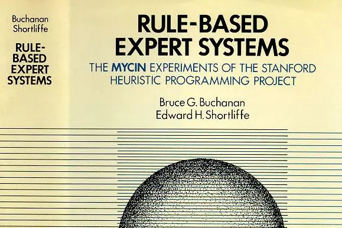
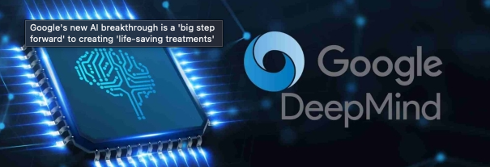
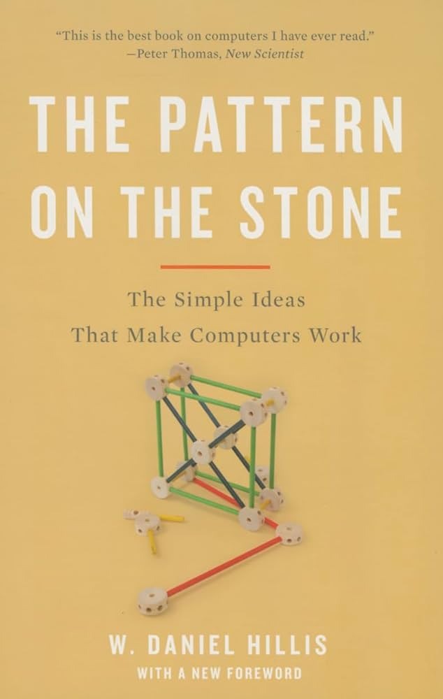

<!-- _class: lead -->
# ICTSS00120 -   Artificial Intelligence Skill Set

## Session 1:   Introduction to Artificial Intelligence, Machine Learning, and Deep Learning

Lecturer: Jordan Hill

---
## Welcome!

Welcome to our AI Skillset! 

- **Course Code**: ICTSS00120
- **Delivery Period**: 2024, S2
- **Lecturer**: Jordan Hill
- **Contact**: [jordan.hill@nmtafe.edu.au](mailto:jordan.hill@nmtafe.edu.au)
- **Room**: Perth 306 (30 Aberdeen st)

---

## Informed choices - is this course right for me?
This course expects you to have well developed skills in Python.
This means you:
  - Possess the ability to construct algorithms using computational thinking for solving diverse problems.
  - Have experience in programming with Python for the purpose of executing algorithms.
  - Possess knowledge of the computational problem-solving process.
  - Have familiarity with and the ability to apply standard computational problem-solving techniques.

---

## Alternative Pathways
If you feel you don't have these skills there are alternate pathways available to you which may better suit you.

We have a Data Analysis skillset which teaches a similar skillset at a more forgiving pace.

We also have an online python and git course which can be taken as part of the Cert IV Programming.

We will not have time to teach these foundational skills in this course!

---

## About your lecturer

- Academic background in medieval literature & history; also studied classics & philosophy in the US at St John's College, Annapolis.
- Have a Graduate Certificate in Data Science from RMIT University
- Worked in mining-related start-ups in Perth in software engineering
- Currently, working on an AI startup using deep learning to model & predict traffic

Contact: Jordan.hill@nmtafe.wa.edu.au

---

# About the skillset

This course is a zero-to-hero in AI, Machine Learning, and Deep Learning.

It is designed to be self-scoping, essentially you will have the freedom to learn as much as you have time to devote to the subject.

AI is a huge field and is *constantly* changing. The goal of this course is to try to equip you to **continue your learning** in the field after you leave the course.

---

# About the skillset

## Course Structure
Term 1: Will focus on gaining a foundational understanding of AI and its applications in industry at present

Term 2: Will focus entirely on using supervised training methods to build our own models to a defined use-case based on the CRISP-DM methodology.

---

# About the skillset

## Assessment structure
4 Assessments overall.
2 are short answer knowledge-based assessments, 2 are practical.

First assessment involves a 5-minute pitch.
Your project can and should be informed by your first assessment.

You are encouraged to choose a topic for your final project of interest to yourself or useful in your current workplace. It really can be anything you like!

---

# Term 1

### Assessment 1: AT1 Identify Opportunities for AI Task Automation

Demonstrate your understanding of AI and it's applications for industry
**Due Week 7 (August 30th)**

### Assessment 2: AT2 Knowledge-Based Assessment (Weeks 1–6)

You will demonstrate an initial knowledge of general concepts relating to AI.
**Due Week 10 (September 20th)**

---

# Term 2

### Assessment 3: AT3 Knowledge Based Assessment (Weeks 8-13)
You will demonstrate specific technical knowledge of deep learning processes and concepts.
**Due Week 15 (1 November)**

### Assessment 4: AT4 Apply Machine Learning to Task Automation
Final project using machine learning to automate work tasks.
**Due Week 18 (22nd November)**

---

## Learning Objectives for Week 1

**Key Learning Objectives for Today**:
- Gain a general overview and history of AI, ML, and DL.
- Identify key features and functions of AI technologies.
- Recognize industry-recognized AI, ML, and DL technologies.
- Discuss tasks and processes commonly automated using AI.
- Analyze the advantages and disadvantages of AI, ML, and DL technologies.

---

## Class Discussion

**What is AI?**
- **What do we know about it?**:
  - Movies & Books?
  - News recent events?
  - Who has used an "AI" before? (ChatGPT?)
  
---

## Overview and History of AI

**What is AI?**:  
AI (Artificial Intelligence) involves creating machines capable of performing tasks that typically require human intelligence.

---

**A Brief Chronology / Origin of the field**

- **1950s**: Early research by Alan Turing and the introduction of the **Turing Test**.
- **1956**: **Dartmouth Conference**, where the term **"Artificial Intelligence"** was coined.
- **1960s-70s**: Development of initial AI programs and *symbolic reasoning*.
- **1980s**: Introduction of machine learning.
- **1990s-2000s**: Advances in neural networks and deep learning.
- **2010s-2020**: Explosion of AI applications in various fields, driven by big data, powerful computing, and advanced algorithms.

--- 

<!-- _class: lead -->
# The "Eras" of AI

---

## Early Foundations of AI

### McCulloch and Pitts (1943):
- Paper: “A Logical Calculus of the Ideas Immanent in Nervous Activity.”
- Developed a mathematical model of an artificial neuron using addition and thresholding.
- Concept: Neural events described using propositional logic.

### Frank Rosenblatt (1958):
- Advanced artificial neurons by enabling them to learn.
- Created the Mark I Perceptron, capable of recognizing simple shapes.

---

## Birth of AI (1950s)

### Alan Turing and Early Concepts:
- 1950: Turing's "Computing Machinery and Intelligence" paper introduces the Turing Test.

### Dartmouth Workshop (1956):
- Founding event of AI research.
- Researchers begin developing programs for learning, problem-solving, and basic human-like tasks.

---

## Golden Age of AI (1960s-1970s)

### Initial Optimism:
- AI Labs established in the U.S. and U.K.
- Early successes in tasks like checkers strategy and theorem proving.

### Setbacks:
- Minsky and Papert’s "Perceptrons" (1969) showed limitations of single-layer perceptrons.
- Led to overestimating the difficulty of achieving general AI.
- 1974: Funding cuts resulted in the first "AI winter."

---

## First AI Winter (1974-1980)

### Challenges and Misunderstandings:
- Criticism by Sir James Lighthill led to significant funding reductions.
- Misinterpretation of Minsky and Papert’s findings caused disillusionment with neural networks.

---

## Revival and Expert Systems (1980s)

### Surge of Interest:
- Success of expert systems in commercial applications.
- 1985: AI market exceeds a billion dollars.
- Renewed funding driven by Japan’s fifth-generation computer project.

### Subsequent Decline:
- 1987: Collapse of Lisp Machine market led to a second AI winter.
- Shift from high-level symbolic representation to sub-symbolic approaches.

---
## Early AI and Symbolic Reasoning Era

- **1950s-1980s**: Emergence of AI with rule-based systems and symbolic reasoning
  - *Example*: MYCIN, an early expert system for medical diagnosis (1970s)
- **1980s**: Introduction of Backpropagation for training neural networks

<!-- Rumelhart; Hinton; Williams (1986). "Learning representations by back-propagating errors" (PDF). Nature. 323 (6088): 533–536. -->

<!-- Linnainmaa, Seppo (1970). The representation of the cumulative rounding error of an algorithm as a Taylor expansion of the local rounding errors (Masters) (in Finnish). University of Helsinki. pp. 6–7. -->

---

## Second AI Winter (Late 1980s-1990s)

### Sub-symbolic Approaches:
- Development of neural networks and handling uncertain information.
- Geoffrey Hinton revived connectionism. (an approach to the study of human cognition that utilizes mathematical models, eg neural networks)
- 1990: Yann LeCun’s convolutional neural networks recognized handwritten digits.

---

## Practical Applications and AGI (1990s-2000s)

### Narrow AI:
- Focus on domain-specific solutions yielding verifiable results.
- Collaboration with fields like statistics and economics.

### Emergence of AGI (Artificial General Intelligence) as a Goal:
- Around 2002: Revival of the goal to create fully intelligent machines.
- Establishment of artificial general intelligence (AGI) subfield.

---

## Machine Learning Era

- **1997**: IBM's Deep Blue defeats world chess champion Garry Kasparov
  - Demonstrated the power of search algorithms and heuristic-based AI
- **2006**: Geoffrey Hinton's deep belief networks rekindles interest in deep learning

---

## Deep Learning Revolution (2012-Present)

### Key Breakthroughs:
- 2012: Deep learning approaches start to dominate industry benchmarks and competitions.
- Hardware improvements (GPUs, cloud computing) and access to large datasets (ImageNet) drive success.

### Industry Impact:
- Deep learning rekindled interest and funding in AI.
- Machine learning research publications surged between 2015-2019.

---

## Deep Learning Breakthroughs

- **2012**: AlexNet wins ImageNet competition
  - Achieved breakthrough in image recognition using convolutional neural networks (CNNs)
- **2014**: GANs (Generative Adversarial Networks) introduced by Ian Goodfellow
  - Enabled generation of realistic synthetic data

---

## Ethical Concerns and Recent Advances (2016-Present)

### Ethical Issues:
- Rising focus on fairness, misuse of technology, and alignment problems.
- Notable Programs:
  - 2015: DeepMind’s AlphaGo defeats world champion.
  - 2020: OpenAI's GPT-3 generates human-like text.

### AI Boom:
- Significant investments (~$50 billion annually by 2022 in the U.S.).
- Proliferation of AI-related job openings and specialized AI PhD graduates.

---

## Attention Mechanism and Transformers

- **2014**: Introduction of the Attention mechanism in neural networks
  - Enhanced performance in sequence-to-sequence tasks, notably in translations
- **2017**: Google's "Attention is All You Need" paper introduces the Transformer model
  - Revolutionary architecture for natural language processing tasks

---

## Pre-trained Language Models

- **2018**: OpenAI's GPT (Generative Pre-trained Transformer) released
  - Demonstrated the power of pre-training and fine-tuning on large text corpora
- **2019**: Introduction of BERT (Bidirectional Encoder Representations from Transformers) by Google
  - Improved context understanding by processing text bidirectionally

---

## Towards ChatGPT

- **2020**: GPT-3 by OpenAI
  - Massive language model with 175 billion parameters, capable of diverse NLP tasks
- **2020**: T5 (Text-To-Text Transfer Transformer) by Google Research
  - Unified framework for multiple NLP tasks, showing the versatility of transformers

---

## Release of ChatGPT

- **November 2022**: OpenAI released ChatGPT
  - User-friendly model built on GPT-3.5 architecture
  - Capable of engaging in conversational dialogues, answering questions, and generating text

---

# To Sum Up

- AI has evolved from symbolic reasoning to sophisticated neural networks.
- Key breakthroughs: CNNs (AlexNet), GANs, MLP/FNN, Attention Mechanism, Transformers.
- ChatGPT represents a culmination of these advancements in the form of a conversational AI.

Does ChatGPT pass the turing test for you?

---

---

## AI Paradigms in Contrast

- **Machine Learning (ML)**: Data-driven, learns patterns from data.
  - *Example*: Neural networks for image recognition.
- **Deep Learning (DL)**: Subset of ML with deep neural networks.
  - *Example*: CNNs for video recognition.

---

## Hybrid and Evolutionary Approaches

- **Neuro-Symbolic AI**: Combines symbolic reasoning and ML.
  - *Example*: Integrates logic with deep learning for reasoning.
- **Evolutionary Algorithms**: Simulates natural selection for optimization.
  - *Example*: Genetic algorithms for engineering problems.

---

## Relations Among Forms

- **Symbolic vs. Machine Learning**:
  - Rule-based and interpretable vs. Data-driven.
- **ML and DL**:
  - Both Machine Learning and Deep learning are Data-driven.
  - ML focuses on general patterns, DL on hierarchical data representations.
- **Hybrid Approaches**:
  - Combines the strengths of symbolic reasoning and ML (data-driven approaches).

---

## Key Features and Functions of AI Technologies

**Functions and Features**:
- **Machine Learning (ML)**: Training models to make predictions based on data.
- **Deep Learning (DL)**: Neural networks with multiple layers for complex pattern recognition.
- **Natural Language Processing (NLP)**: Understanding and generating human language.
- **Computer Vision**: Interpreting and understanding visual information from the world.

---

## Industry-Recognized AI, ML, and DL Technologies

**Technologies**:
- **TensorFlow**: An open-source platform for machine learning.
- **PyTorch**: A deep learning platform known for its flexibility and ease of use.
- **Keras**: A high-level neural networks API, running on top of TensorFlow.
- **Scikit-Learn**: A machine learning library for Python.
- **NLTK & SpaCy**: Libraries for natural language processing.
- **OpenCV**: A library for computer vision tasks.

---

## Tasks and Processes Commonly Automated

**Examples of AI Automation**:
- **Customer Service**: Chatbots answering common queries.
- **Healthcare**: Image analysis for disease detection.
- **Finance**: Fraud detection and automated trading.
- **Manufacturing**: Predictive maintenance and quality inspection.
- **Retail**: Personalized recommendations and inventory management.

---

## Advantages of AI, ML, and DL

**Prominent Advantages**:
- **Efficiency**: Automates repetitive tasks, allowing humans to focus on more complex problems.
- **Accuracy**: Reduces the potential for human error.
- **Speed**: Processes information much faster than humans.
- **Scalability**: Easily handles vast amounts of data and scales operations.

---

## Disadvantages and Challenges in AI, ML, and DL

**Potential Challenges**:
- **Bias**: AI systems can inherit and amplify biases present in training data.
- **Transparency**: Some AI models (like deep learning) are often seen as “black boxes.”
- **Cost**: High initial setup costs and ongoing maintenance.
- **Ethical Concerns**: Issues around privacy, employment displacement, and decision-making.

---

## In-Class Research Activity

**Activity**:
- **Explore Industry Technologies in AI, ML, and DL**:
  - Divide into groups and research industry-specific applications of AI.
  - Find examples of supervised and unsupervised learning in action.
  - Each group presents their findings.
  
---

## Additional materials

This course has a companion reading list!
*(as if there wasn't enough to do)*

**"The Moon is a Harsh Mistress" by Robert A. Heinlein** (1966)
A lunar colony's AI, named Mike, gains self-awareness and aids in a revolution against Earth's government, highlighting themes of AI autonomy and human-machine relationships.

---

## Additional materials

**The Pattern on the Stone: The Simple Ideas that Make Computers Work by Danny Hillis**
"The Pattern on the Stone" by Danny Hillis offers an accessible explanation of the fundamental concepts of computer science and how computers work, using simple analogies and clear examples.

---

## Extra links

Alan Turing's Original paper: **[Can machines think?](https://academic.oup.com/mind/article/LIX/236/433/986238)**
Quite a Comprehensive video overview: **[The moment we stopped understanding AI [AlexNet]](https://www.youtube.com/watch?v=UZDiGooFs54)**

---

## Summary and Q&A

**Summary**:
- Today we covered the basics of AI, its history, key features, industry technologies, automation tasks, and the pros and cons of AI.
- Next week, we will delve deeper into specific areas such as supervised learning.

**Q&A**
Any questions/discussion??
<!-- - Open the floor for questions and clarifications. -->
<!-- - Encourage students to reach out with any questions via email or during office hours. -->

