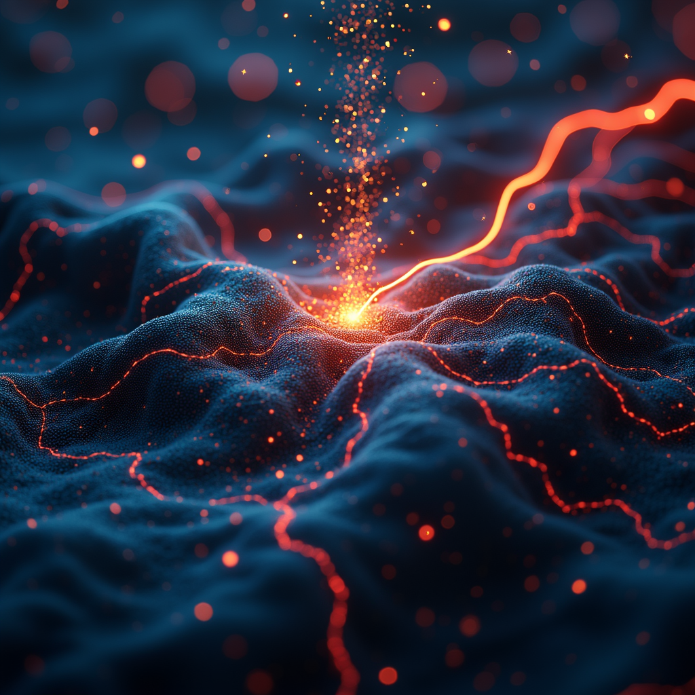

<!-- _class: lead -->
# ICTSS00120 -   Artificial Intelligence Skill Set

## Session 10: Fundamentals in Deep Learning & Introduction to Machine Vision

Lecturer: Jordan Hill

---

## Learning Objectives

- Understand the basics of linear algebra and tensors for deep learning.
- Explore computing tensors, GPU vs CPU.
- Learn feature engineering and data preprocessing techniques for deep learning.
- Understand activation functions and their roles.
- Delve deeper into Convolutional Neural Networks (CNNs) and their applications in machine vision.

---

---

## Linear Algebra for Machine Learning

### Scalars, Vectors, and Tensors

- **Scalar**: A single number.
  - Example: $a = 1$
- **Vector**: An array of numbers.
  - Example: $\mathbf{v} = [1, 2, 3]$
- **Matrix**: A 2D array of numbers.
  - Example: $\mathbf{M} = \begin{bmatrix}1 & 2 \\ 3 & 4\end{bmatrix}$
- **Tensor**: An n-dimensional array of numbers.
  - Example: $\mathbf{T}$ could be a 3D array, a 4D array, etc.

---

## Computing Tensors: GPU vs CPU

- **Central Processing Unit (CPU)**: General-purpose processor.
  - Best for tasks with lower parallelism.
- **Graphics Processing Unit (GPU)**: Specialized for highly parallel tasks.
  - Crucial for deep learning, handling large tensors efficiently.

---
## Computing Tensors: TPU vs NPU

- **NPU (Neural Processing Unit)**:
  - **Architecture**: Specialized for neural network computations.
  <!-- - **Peak Performance**: Higher than TPUs, handles more complex tasks efficiently.
  - **Latency and Power Consumption**: Higher than TPUs, more suitable for tasks needing high precision. -->
  - **Applications**: Real-time applications like translation, facial recognition, voice assistants.

- **TPU (Tensor Processing Unit)**: (Google)
  - **Architecture**: Optimized for TensorFlow operations.
  <!-- - **Peak Performance**: Lower than NPUs for specific tasks but optimized for large volume data processing.
  - **Latency and Power Consumption**: Lower than NPUs, faster with lower energy use. -->
  - **Applications**: Data centers, training large machine learning models, Google Cloud services.

---

## Feature Engineering and Data Preprocessing

### Techniques for Deep Learning

- **Normalization**: Scaling features to a standard range.
- **Standardization**: Transforming data to have zero mean and unit variance.
- **Data Augmentation**: Creating new training instances by modifying existing data (e.g., rotations, flips for images).

---

## Activation Functions

### Key Functions

- **ReLU (Rectified Linear Unit)**: $f(x) = \max(0, x)$
  - Benefits: Avoids vanishing gradients, computationally efficient.
- **Sigmoid**: $f(x) = \frac{1}{1 + e^{-x}}$
  - Benefits: Outputs in range (0, 1), used for probability estimation.
- **Tanh**: $f(x) = \frac{e^x - e^{-x}}{e^x + e^{-x}}$
  - Benefits: Outputs in range (-1, 1), zero-centered.
  

---

## Convolutional Neural Networks (CNNs)

### Basics and Applications

- **Structure**:
  - **Convolutional Layers**: Apply convolution operations to extract features.
  - **Pooling Layers**: Reduce the dimensionality of feature maps.
  - **Fully Connected Layers**: Perform high-level reasoning and classification.
- **Applications**:
  - Image recognition, object detection, and video analytics.

---

## Deep Dive into CNNs

### Understanding Convolutional Layers

- **Convolutions**: Apply filters (kernels) to the input image to create feature maps.
- **Filters**: Small matrices that slide over the input to detect patterns (e.g., edges, textures).

---

## Deep Dive into CNNs

### Pooling Layers

- **Max Pooling**: Takes the maximum value in a window (e.g., 2x2) to down-sample the feature map.
- **Average Pooling**: Takes the average value in a window to down-sample.

---

## Practical Applications of CNNs

### Image Recognition and Beyond

- **Image Classification**: Recognizing objects in images (e.g., cats, dogs, cars).
  - Example: AlexNet winning the ImageNet competition.
- **Object Detection**: Identifying and locating objects within images.
  - Example: YOLO (You Only Look Once) detecting multiple objects in real-time.
- **[Segmentation](https://ai.meta.com/sam2/)**: Dividing an image into meaningful regions.
  - Example: U-Net for medical image segmentation.

---

<!-- <h3> Hello </h3> -->
<video controls autoplay loop width="500"> <source src="images/soccer.mp4" type="video/mp4"> </video>
<video controls autoplay loop width="500"> <source src="images/sam.mp4" type="video/mp4"> </video>

---

## Lab: Building a Simple CNN for Image Classification

*Let's look at CNN and Machine vision more closely*

### [Lab Sheet](https://miro.medium.com/max/2000/1*8DxFaX4qCqLXuS8UVOAqew.png)

---

## Summary and Q&A

### Summary:
- Learned about basics of linear algebra and tensors.
- Explored GPU vs CPU for computing tensors.
- Learned feature engineering and data preprocessing techniques.
- Understood key activation functions.
- Delved deeper into CNNs and their applications.

### Q&A:
- Any questions about today's topics?

Contact: jordan.hill@nmtafe.wa.edu.au

---

## Homework

**Next Week**:
- Introduction to Recurrent Neural Networks (RNNs).
- Explore RNNs and their applications in sequence prediction.

### Tasks:
1. Review key concepts covered today.
2. Read about RNNs and their applications.
3. Watch related videos on deep learning and CNNs.

