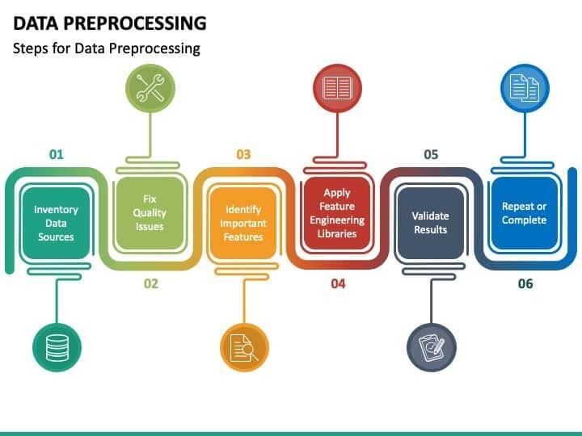

---

footer: ""
marp: true
theme: nmt-theme

---

<!-- _class: lead -->
# ICTSS00120 -   Artificial Intelligence Skill Set

## Week 2: Data for Machine Learning

Lecturer: Jordan Hill

---

## Today's Agenda

- Introduction and Objectives
- IPython Environment and Kaggle
- Types of Data and Data Sources
- Understanding ML Attributes
- Relevant Algorithms for Datasets
- Data Preprocessing Techniques (Briefly)
- In-Class Activity: Introduction to Kaggle environment and Data Cleaning
- Summary and Q&A

---
## Learning Objectives

- Understand the IPython environment and how to use Kaggle.
- Identify key data sources for machine learning.
- Differentiate between structured, unstructured, labelled, and unlabelled data.
- Comprehend ML attributes: data attributes, model attributes, and target attributes.
- Recognize relevant algorithms for different types of datasets.
- Grasp data biases and methods for generating balanced data.
- Introduction to data preprocessing techniques such as randomizing, deduplication, and data cleaning.
- Understand the importance of creating training, validation, and test subsets.

---

<!--  -->

## Introduction to IPython and Kaggle

####      What is it? And why do we use it??
- Interactive computing environment for writing and sharing Python code.
- Supports visualization, markdown, and LaTeX.
- **Why Important?**
  - Facilitates exploratory data analysis.
  - Enhances code readability and sharing.
  - Enables reproducibility of experimentation results

---

- Online platform for data science competitions and collaboration.
- Provides datasets, code snippets, and a notebook environment.
- Provides GPU accelerated environment for working with vision and LLM tasks!

---

## Key Data Sources

**Identifying Key Data Sources:**
- **Public Repositories:** Examples include UCI ML Repository, Kaggle Datasets, and government open data websites.
- **APIs:** Data from web services such as Twitter, OpenWeatherMap, etc.
- **Internal Data:** Company databases, CRM systems, and internal APIs.

<!-- What kinds of data sources are available to you at your work? -->

---

## Types of Data

**Structured Data:**
- Clearly defined data types.
- Organized in rows and columns.
- Examples: Databases, spreadsheets.

**Unstructured Data:**
- No predefined structure.
- Text, images, videos, etc...
- Examples: Emails, social media posts.

---

## Types of Data (Machine Learning / AI)
**Labelled Data:**
- Each data point is assigned a label.
- Used for supervised learning.
- Example: Emails labelled as ‘spam’ or ‘not spam’.

**Unlabelled Data:**
- No labels are assigned to data points.
- Used for unsupervised learning.
- Example: Customer purchase data without any categorization.

---
## Relevant Algorithms for Labelled & Unlabelled Data

###### Labelled Datasets:
- **Supervised Learning:**
  - Regression: Linear Regression. [Data Regression](https://www.youtube.com/watch?v=ek0yyL8iV7I&list=PLzH6n4zXuckpfMu_4Ff8E7Z1behQks5ba&index=12)
  - Classification: Decision Trees, SVM, 
  Naive Bayes, KNN. [Classification in ML](https://www.youtube.com/watch?v=1opLSwlqBSI&list=PLzH6n4zXuckpfMu_4Ff8E7Z1behQks5ba&index=10)

###### Unlabelled Datasets:
- **Unsupervised Learning:**
  - Clustering: K-Means, DBSCAN. [What is K-Means?](https://www.youtube.com/watch?v=yR7k19YBqiw)
  - Dimensionality Reduction: PCA, LDA. [What is PCA?](https://www.youtube.com/watch?v=TJdH6rPA-TI&list=PLzH6n4zXuckpfMu_4Ff8E7Z1behQks5ba&index=8)
  <!-- [PCA vs LDA](https://www.youtube.com/watch?v=cQcrwtDRajs) -->

---

## Understanding ML Attributes

**ML Attributes:**
- :arrow_right: **Data Attributes:** Features or predictors used to train a model.
- **Model Attributes:** Parameters of the model.
- **Target Attributes:** The outcome variable the model is predicting.

---
## Understanding ML Attributes

**ML Attributes:**
- **Data Attributes:** Features or predictors used to train a model.
- :arrow_right: **Model Attributes:** Parameters of the model.
- **Target Attributes:** The outcome variable the model is predicting.

---

## Understanding ML Attributes

**ML Attributes:**
- **Data Attributes:** Features or predictors used to train a model.
- **Model Attributes:** Parameters of the model.
- :arrow_right: **Target Attributes:** The outcome variable the model is predicting.

---

## Understanding Data Biases

**Statistical Bias:**
- **Definition:** Systematic error introduced into data collection.
- **Examples:**
  - Sampling bias.
  - Measurement bias.
- **Mitigation Techniques:** 
  - Ensure diverse dataset collection.
  - Resampling or reweighting data.

---

## Bias is a broader conversation when it comes to AI systems

1. Cognitive Bias — Bias fed by limitations in our own cognition & perspective
2. Statistical Bias — Affects the quality of our models
3. Prejudice / Descrimination — Prejudice on the basis of race, sex, age, etc...
4. Conflicts of Interest — Corruption / vested interests

*The world may be biased in ways we don't want to perpetuate! 
We want to design AI systems that are benevolent and beneficial.*

As data scientists, we have a moral obligation to ensure we develop systems ethically. Notions of **good** & **bad**, **right** & **wrong** are highly relevant to the design of AI systems.
**Question your Data!**

---

<!-- _class: lead -->

# How can we actually identify & deal with *statistical* bias?

---

## Identifying and Reducing Statistical Bias

### Methods for Identifying Statistical Bias
- **Exploratory Data Analysis (EDA):**
  - Use visualizations (e.g., histograms, box plots) to detect distributions and outliers.
  - Summarize data using descriptive statistics (mean, median, mode).
- **Statistical Tests:**
  - Perform tests (e.g., Chi-square test, T-test) to check for bias in dataset distributions.
- **Correlation Analysis:**
  - Evaluate correlations between features to identify multicollinearity issues.
- **Audit for Missing Data:**
  - Identify patterns in missing data to detect if data is missing at random (MAR) or not at random (MNAR).

---
## Generating Balanced Data

**Generating Balanced Data:**
- **Techniques to Balance Data:**
  - [Oversampling minority class.](https://imbalanced-learn.org/stable/over_sampling.html)
  - [Undersampling majority class.](https://imbalanced-learn.org/stable/under_sampling.html)
  - [SMOTE (Synthetic Minority Over-sampling Technique)](https://imbalanced-learn.org/stable/references/generated/imblearn.over_sampling.SMOTE.html#smote).

---

## Reducing Statistical Bias in Datasets
1. **Data Collection/Preperation Improvements:**
   - Use random sampling of larger populations to avoid an **introduced** sampling bias when collecting data.
   - Ensure diverse and representative dataset collection.

2. **Data Resampling Techniques:**
   - **Oversampling:** Increase the number of minority class samples.
     - Example: [SMOTE (Synthetic Minority Over-sampling Technique)](https://imbalanced-learn.org/stable/references/generated/imblearn.over_sampling.SMOTE.html#smote).
   - **Undersampling:** Reduce the number of majority class samples.
     - Example: [Random undersampling.](https://imbalanced-learn.org/stable/references/generated/imblearn.under_sampling.RandomUnderSampler.html)

---

## Reducing Statistical Bias in Datasets

3. **Data Augmentation:**
   - Create synthetic data points to balance datasets.
   - Techniques include geometric transformations for images, paraphrasing for text.

4. **Normalization and Standardization:**
   - Scale numerical features to have similar ranges, reducing the impact of features with larger scales.
   - Normalize data to have a mean of zero and a standard deviation of one.

---

## Reducing Statistical Bias in Datasets

5. **Cross-Validation:**
   - Use K-fold cross-validation to ensure bias isn’t introduced through data splitting.
   - Helps in assessing model performance on different subsets of data.

6. **Bias Correction Algorithms:**
   - Implement algorithms designed to reduce bias, such as reweighting or adversarial de-biasing.

---

## The Importance of Balance in Data
- Imbalanced datasets can lead to biased models that favor majority classes.
- Balancing the data ensures that the model treats all classes equally and performs better on minority classes.

---

### Techniques to Balance Data:
1. **Oversampling**
   **Definition:** Increasing the number of samples in the minority class to match the majority class.

2. **Undersampling**
   **Definition:** Reducing the number of samples in the majority class to match the minority class.

3. **Data Augmentation**
   **Definition:** Creating new data points to add to the dataset, often used for image or text data.

<!--  -->

---

## Key Techniques Explained
### SMOTE (Synthetic Minority Over-sampling Technique)
- **How It Works:**
  - For each minority class sample, find its k-nearest neighbors.
  - Randomly select one of the neighbors and create a synthetic sample along the line between the original sample and its neighbor.

### Random Undersampling
- **How It Works:**
  - Randomly remove samples from the majority class.
  - This reduces the number of majority class samples to match the number of minority class samples.
 
---
### Data Augmentation for Images
- **How It Works:**
  - Apply transformations such as rotations, flips, crops, and color adjustments to existing images.
  - This generates new, varied images while preserving labels.

### Data Augmentation for Text
- **How It Works:**
  - Generate new sentences with the same meaning but different structure.
  - Use techniques such as paraphrasing, synonym replacement, or back-translation. 
  
  It seems like OpenAI forgot to do this last one with "delve", 
  ChatGPT seems to really like it for some reason...

---
# Whoops!
<!-- _class: centre -->

---

## Data Preprocessing for ML

**Randomizing:** Shuffle data to prevent order effects.
**Deduplication:** Remove duplicate records.
**Data Cleaning:** Handle missing values, correct inconsistencies.

---

---

## Creating Data Subsets

**Creating Data Subsets:**
- **Training Subset:** Used to train the model.
- **Validation Subset:** Used to tune model parameters.
- **Test Subset:** Used to evaluate the final model performance.

[Good Overview Wikipedia](https://en.wikipedia.org/wiki/Training,_validation,_and_test_data_sets)

**Why Important?**
- Ensures the model generalizes well to unseen data.
- Helps in detecting overfitting and underfitting.

---

## In-Class Activity

**Activity:**
- Load a dataset into Kaggle.
- Evaluate its suitability for machine learning.
- Visualize the dataset and perform initial exploratory data analysis.

[Lab Sheet](https://github.com/jordanhill-NMTAFE/AISS-ICTSS00120/blob/main/1%20Learning%20Materials/Week%202/lab.md)

1. Log in to Kaggle.
2. Find a dataset.
3. Load it into a notebook.
4. Visualize basic statistics and charts. (ChatGPT/Co-pilot can help with this!)

---
**Questions to Explore & Discuss with your Peers:**
- What kind of data (structured/unstructured; labelled/unlabelled) is this?
- What preprocessing steps might be necessary?
- What biases might exist in the data?
- Are there any biases in the data? How could you identify them?
- What could be done to correct bias?
- How would you split the data into training, validation, and test sets?

---

## Summary

- Introduced to IPython, Kaggle, and key data sources.
- Discussed types of data and ML attributes.
- Covered relevant algorithms for different datasets.
- Understood data biases and techniques for balanced data.
- Learned data preprocessing steps and importance of data subsets.

---

## Key Takeaways

- **IPython and Kaggle:** Essential tools for data manipulation and collaboration.
- **Data Types:** Understanding structured vs. unstructured and labelled vs. unlabelled data.
- **ML Attributes:** Importance of data attributes, model attributes, and target attributes.
- **Algorithms:** Supervised and unsupervised learning techniques.
- **Bias and Balancing:** Techniques to identify and mitigate biases in datasets.
- **Preprocessing:** Critical steps in preparing data for machine learning.

---

## Questions & Answers

**Q&A**
- Any Questions from today's session??

---

## Next Week

**Next Week:**
- Essentials of ML and DL Technologies.
- Dive deeper into supervised and unsupervised learning techniques.
- Intro to sci-kit learn

