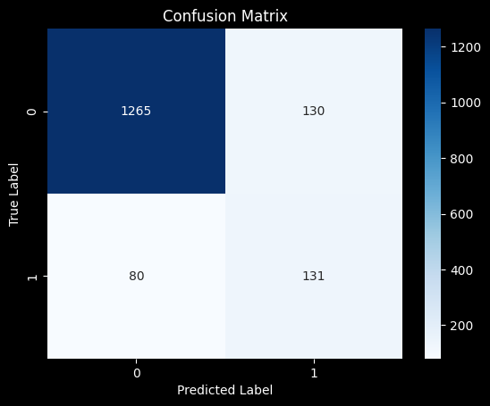

<!-- _class: lead -->
# ICTSS00120 - <br> Artificial Intelligence Skill Set


## Evaluation Metrics

Lecturer: Jordan Hill

<style scoped>
p {
  padding:0.25em;
  padding-right:1em;
  text-align: right;
}
</style>

---

## Learning Objectives

- Understand the key evaluation metrics for machine learning models.
- Learn how to calculate and interpret each metric.
- Relate the metrics to the spam detection example from the lab.
- Appreciate the importance of different metrics in different contexts.

---

## Key Evaluation Metrics: An Overview

1. **Accuracy**
2. **Precision**
3. **Recall**
4. **F1 Score**
5. **Confusion Matrix**

These metrics are essential for evaluating the performance of your machine learning models. Let's dive into each one in detail.

---

## Starting definitions

- TP (True Positives): The number of instances correctly predicted as positive.                                                                                                                                                       
- TN (True Negatives): The number of instances correctly predicted as negative.                                                                                                                                                       
- FP (False Positives): The number of instances incorrectly predicted as positive.                                                                                                                                                    
- FN (False Negatives): The number of instances incorrectly predicted as negative. 

---

## Accuracy

**Definition**: 
- The ratio of correctly predicted instances to the total instances.

**Formula**: 
$\text{Accuracy} = \frac{\text{True Positives + True Negatives}}{\text{True Positives + True Negatives + False Positives + False Negatives}}$

 **Usage**:       
 - Provides a single measurement of the model's performance.                                                                                                                                                                           
 - Useful when the class distribution is balanced. 


---

## Precision

**Definition**: 
- The ratio of true positive predictions to the sum of true positive and false positive predictions.

**Formula**: 
$$\text{Precision} = \frac{\text{True Positives}}{\text{True Positives + False Positives}}$$

**Usage**: 
- Indicates how many positive predictions were actually correct.
- Important in contexts where the cost of false positives is high. (eg. Medical Tests)


---

## Recall (Sensitivity, True Positive Rate)

**Definition**: 
- The ratio of true positive predictions to the sum of true positive and false negative predictions.

**Formula**: 
$\text{Recall} = \frac{\text{True Positives}}{\text{True Positives + False Negatives}}$

**Usage**: 
- Indicates how many actual positives were captured by the model.
- Critical in contexts where catching all positive cases is important.


---

## F1 Score

**Definition**: 
- The harmonic mean of precision and recall.

**Formula**: 
$\text{F1 Score} = \frac{2 \cdot \text{Precision} \cdot \text{Recall}}{\text{Precision + Recall}}$

**Usage**: 
- Provides a single metric that balances precision and recall.
- Useful when you need a balance between precision and recall.


---

## Confusion Matrix

**Definition**: 
- A table used to describe the performance of a classification model on a set of test data for which the true values are known.

**Components**:
- **True Positive (TP)**: Correctly predicted positive instances.
- **True Negative (TN)**: Correctly predicted negative instances.
- **False Positive (FP)**: Incorrectly predicted as positive (Type I error).
- **False Negative (FN)**: Incorrectly predicted as negative (Type II error).



---

## Example: Confusion Matrix in Spam Detection

### Initial SVM Result:
```
Confusion Matrix:
[[1200  195]
 [  43  168]]

Precision: 0.46
Recall: 0.80
F1 Score: 0.59
```

- **TN (1200)**: Ham correctly identified as Ham.
- **FP (195)**: Ham incorrectly identified as Spam.
- **FN (43)**: Spam incorrectly identified as Ham.
- **TP (168)**: Spam correctly identified as Spam.

---

## Accuracy in Spam Detection

**Formula**: 
$\text{Accuracy} = \frac{\text{True Positives + True Negatives}}{\text{True Positives + True Negatives + False Positives + False Negatives}}$

**Result**: 
$\text{Accuracy} = \frac{1200 + 168}{1200 + 168 + 195 + 43} \approx 0.85$

**Interpretation**: 
85% of the time, the classifier made correct predictions, but this metric alone does not provide a full picture, especially with imbalanced classes.

---

## Precision in Spam Detection

**Formula**: 
$\text{Precision} = \frac{\text{True Positives}}{\text{True Positives + False Positives}}$

**Result**: 
$\text{Precision} = \frac{168}{168 + 195} \approx 0.46$

**Interpretation**: 
Only 46% of the messages identified as spam were actually spam. Indicates high false positive rate.

---

## Recall in Spam Detection

**Formula**: 
$\text{Recall} = \frac{\text{True Positives}}{\text{True Positives + False Negatives}}$

**Result**: 
$\text{Recall} = \frac{168}{168 + 43} \approx 0.80$

**Interpretation**: 
80% of the actual spam messages were correctly identified as spam. Indicates high sensitivity to capturing spam.

---

## F1 Score in Spam Detection

**Formula**: 
$\text{F1 Score} = \frac{2 \cdot \text{Precision} \cdot \text{Recall}}{\text{Precision + Recall}}$

**Result**: 
$\text{F1 Score} = \frac{2 \cdot 0.46 \cdot 0.80}{0.46 + 0.80} \approx 0.59$

**Interpretation**: 
Balances the precision and recall. Useful in this context where both false positives and false negatives are important.

---

## Why Use Multiple Metrics?

- **Accuracy**: Good for balanced datasets but not informative for imbalanced classes.
- **Precision**: Important when the cost of false positives is high.
- **Recall**: Critical when the cost of false negatives is high.
- **F1 Score**: Provides a balance between precision and recall.
- **Confusion Matrix**: Offers a complete view of model performance.

Using multiple metrics provides a more comprehensive evaluation of the model's performance and helps in understanding its strengths and weaknesses.

---

## Questions & Discussion
**Q&A**: 
- Any questions about the evaluation metrics?
- How would you apply these metrics to other types of classification problems?

Contact: jordan.hill@nmtafe.wa.edu.au


